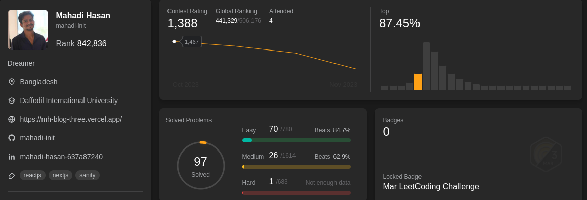

# Leetcode

Solution of leetcode problems with **Kotlin**
<br/>



Check my Leetcode Profile : [mahadi-init](https://leetcode.com/mahadi-init/)

## Instructions

There are three categories of problem solutions (**Easy**, **Medium**, **Hard**) and three specific folders for
each category. Every folder has an Interface name `Problem` (contains the functions of the problems) and class
name `Solution` (implements the interface and solve the problems).

### Installation Instruction

To run kotlin code, JDK(Java Development Kit) is required. To download JDK, visit Oracle Java download page. <br/>

**Note:** For better experience, use **IntelliJ Idea IDE**

### Code Execution Instruction

It's possible to run kotlin code from command Line, but it's recommended to IntelliJ Idea for Kotlin Development.
IntelliJ Idea have build in **Run** and **Debug** functionality.

### Solutions

### Easy

1. [x] Two Sum
2. [x] Palindrome Number
3. [x] Best Time to Buy and Sell Stock
4. [x] Contains Duplicate
5. [x] Valid Anagram
6. [x] Fibonacci Number
7. [x] Reverse Words in a String III
8. [x] Binary Search
9. [x] Reverse String
10. [x] Squares of a Sorted Array
11. [x] Build Array from Permutation
12. [x] Concatenation of Array
13. [x] Final Value of Variable After Performing Operations
14. [x] Shuffle the Array
15. [x] Running Sum of 1d Array
16. [x] Number of Good Pairs
17. [x] Richest Customer Wealth
18. [x] Maximum Number of Words Found in Sentences
19. [x] Difference Between Element Sum and Digit Sum of an Array
20. [x] Roman to Integer
21. [x] Detect Capital
22. [x] Maximum Count of Positive Integer and Negative Integer
23. [x] Kids With the Greatest Number of Candies
24. [x] Decode XORed Array
25. [x] How Many Numbers Are Smaller Than the Current Number
26. [x] Jewels and Stones
27. [x] Goal Parser Interpretation
28. [x] Defanging an IP Address
29. [x] Convert the Temperature
30. [x] Smallest Even Multiple
31. [x] Add Two Integers

### Medium

1. [x] Maximum Ice Cream Bars
2. [x] Max Increase to Keep City Skyline
3. [x] Minimum Number of Arrows to Burst Balloons
4. [x] Minimum Rounds to Complete All Tasks

### Contest

1. [x] Divisible and Non-divisible Sums Difference (Easy)
2. [x] Minimum Processing Time (medium)
3. [x] Minimum Sum of Mountain Triplets I

# 30 Days of Javascript

Javascript / Typescript specific problem solution using `Typescript`

## Instructions

Folder structure is same as kotlin but as typescript isn't OOP oriented,
Interface and class hasn't used.Instead, the file names are same as problem title.

## Code Execution Instruction

First install bun globally.

```shell
npm i -g bun
```

To run a file, call the function from main function and run the main function.

```shell
bun run main.ts
```

### Typescript

1. [x] Create Hello World Function
2. [x] Counter
3. [x] To Be Or Not To Be
4. [x] Counter II
5. [x] Apply Transform Over Each Element in Array
6. [x] Return Length of Arguments Passed
7. [x] Allow One Function Call
8. [x] Add Two Promises
9. [x] Sleep
10. [x] Array Wrapper


